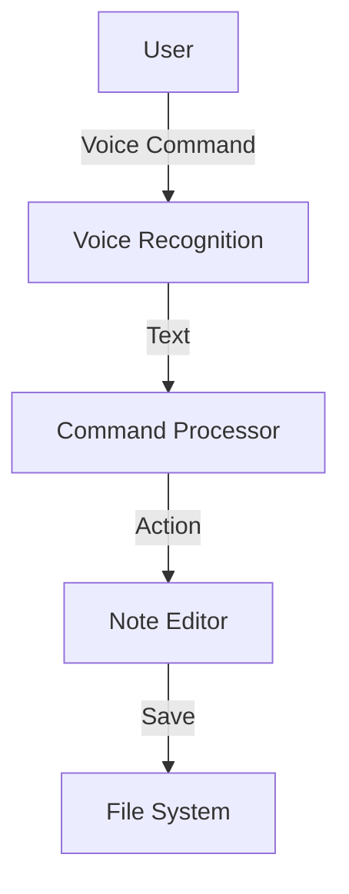

# Diagrams

This directory contains visual representations of VoiceMark's architecture, workflows, and components.

## Contents

### Planned Diagrams

- **System Architecture Diagram** - High-level system overview
- **Component Diagram** - Detailed component relationships
- **Data Flow Diagram** - How data moves through the system
- **Sequence Diagrams** - Interaction flows for key features
- **State Diagrams** - State machines for voice recognition
- **Deployment Diagram** - How components are deployed
- **UI Wireframes** - User interface mockups

## Diagram Formats

Recommended formats (in order of preference):

1. **Mermaid** (`.mmd`) - Text-based, version-control friendly
2. **PlantUML** (`.puml`) - Text-based UML diagrams
3. **SVG** (`.svg`) - Vector graphics, scalable
4. **PNG** (`.png`) - Raster graphics, widely supported

### Mermaid Example

Mermaid diagrams can be embedded directly in Markdown:



### Directory Structure

```
diagrams/
├── architecture/
│   ├── system-overview.mmd
│   └── component-diagram.svg
├── workflows/
│   ├── dictation-flow.mmd
│   └── command-flow.mmd
├── ui/
│   └── wireframes/
└── README.md
```

## Tools

### Recommended Tools

- **[Mermaid Live Editor](https://mermaid.live/)** - Online Mermaid editor
- **[PlantUML](https://plantuml.com/)** - UML diagram generator
- **[Draw.io](https://app.diagrams.net/)** - General diagramming (export to SVG)
- **[Excalidraw](https://excalidraw.com/)** - Hand-drawn style diagrams

### Mermaid in Documentation

GitHub and many Markdown renderers support Mermaid natively:

````markdown

````

## Guidelines

1. **Keep Simple**: Diagrams should clarify, not confuse
2. **Use Consistent Notation**: Stick to standard diagram types
3. **Add Legends**: Explain symbols and colors used
4. **Version Control**: Prefer text-based formats (Mermaid, PlantUML)
5. **Export High-Res**: If using raster images, use high resolution
6. **Include Source**: Keep source files even when exporting to images

## Related Documentation

- [Architecture Documentation](../architecture/) - References these diagrams
- [Functional Documentation](../functional/) - May include workflow diagrams
- [Specifications](../../specs/) - May include UI mockups
