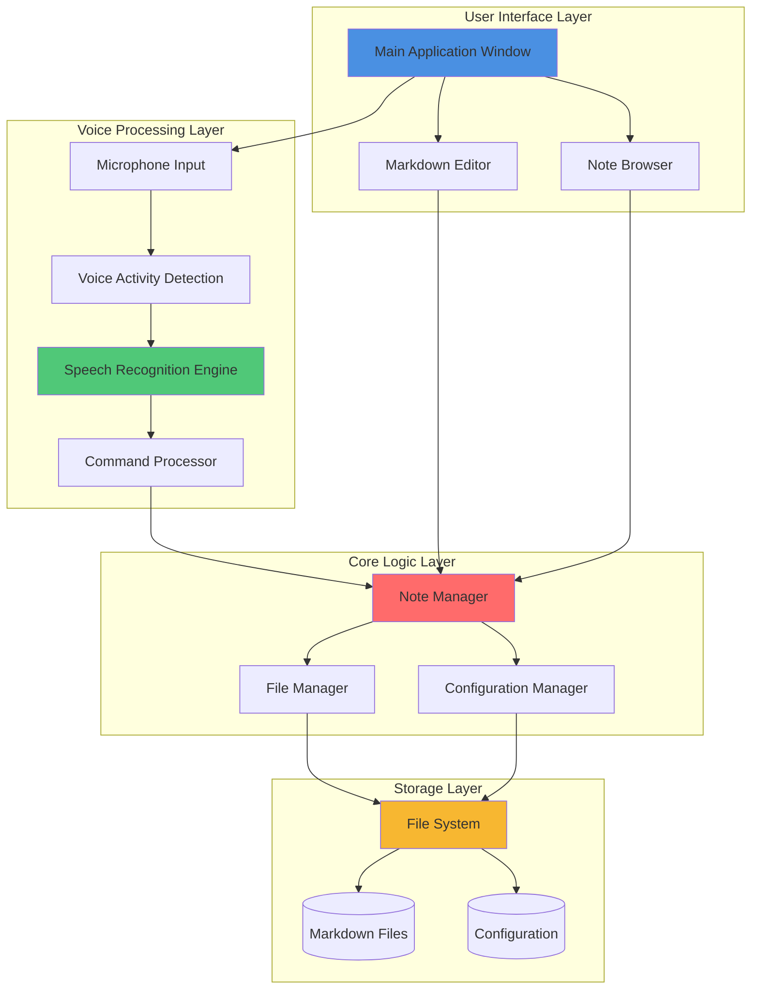
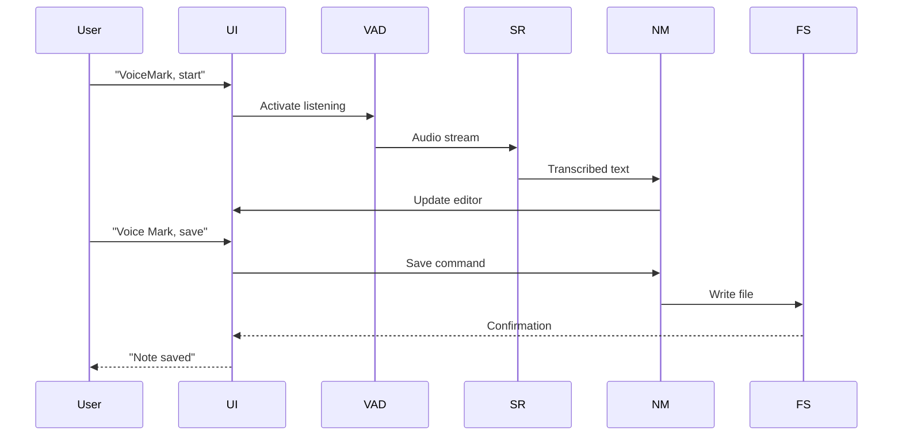
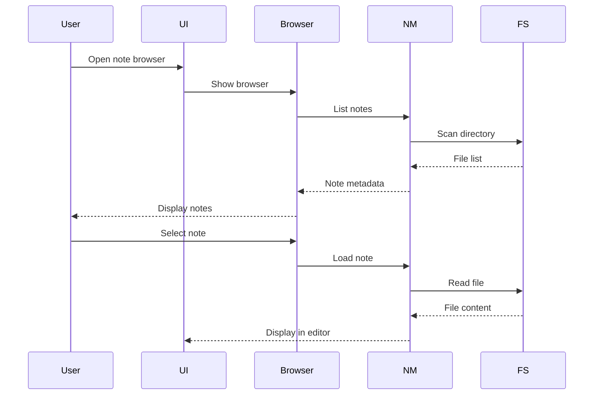

# VoiceMark System Overview

This diagram shows the high-level architecture of VoiceMark.

## Components

### User Interface Layer

- **Main Application Window**: Primary application window with menu and controls
- **Markdown Editor**: Text editor with Markdown support and live preview
- **Note Browser**: File browser for navigating and managing notes

### Voice Processing Layer

- **Microphone Input**: Captures audio from the user's microphone
- **Voice Activity Detection**: Detects when the user is speaking vs silence
- **Speech Recognition Engine**: Converts speech to text (Vosk/Whisper)
- **Command Processor**: Interprets voice commands (e.g., "VoiceMark, save")

### Core Logic Layer

- **Note Manager**: Handles note creation, editing, and organization
- **File Manager**: Manages file I/O operations
- **Configuration Manager**: Handles application settings and preferences

### Storage Layer

- **File System**: Direct interaction with the OS file system
- **Markdown Files**: Notes stored as `.md` files
- **Configuration**: Application settings and user preferences

## Data Flow

### Dictation Flow

### Note Management Flow

## Technology Stack

- **UI Framework**: Electron or Tauri (to be decided)
- **Speech Recognition**: Vosk or Whisper (offline)
- **Editor**: CodeMirror 6 or Monaco Editor
- **Storage**: Direct file system access (no database)
- **Configuration**: JSON or YAML files

## Key Design Decisions

1. **Offline-First**: All processing happens locally
2. **File-Based**: No database, direct file system access
3. **Markdown Native**: Native support for Markdown format
4. **Privacy-Focused**: No data leaves the user's machine

## Related Documentation

- [ADR-002: Offline-First Architecture](../decisions/ADR-002-offline-first-architecture.md)
- [ADR-003: Markdown Storage](../decisions/ADR-003-markdown-storage.md)
- [v0.1 UI Specification](../../specs/v0.1-ui-spec.md)
